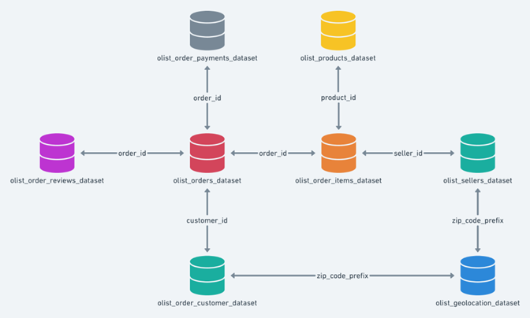
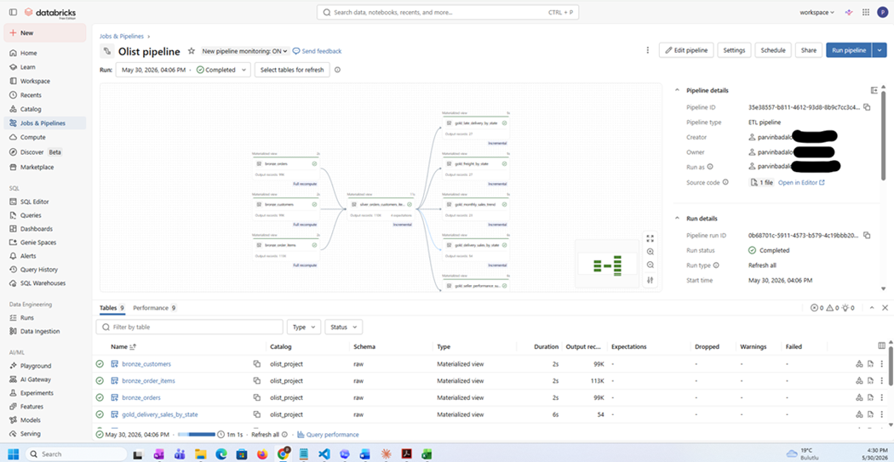
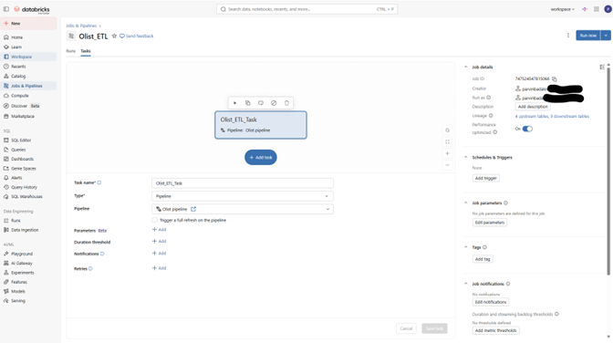

# olist-ecommerce-etl-databricks
## Databricks Objects Created

This project creates the following Databricks objects:

- Catalog: `olist_project`
- Schemas: `raw`, `bronze`, `silver`, `gold`
- Volume: `olist_project.raw.olist_volume`
- Bronze tables:
  - `olist_project.bronze.orders`
  - `olist_project.bronze.customers`
  - `olist_project.bronze.order_items`
- Silver table:
  - `olist_project.silver.orders_customers_items_clean`
- Gold tables:
  - `olist_project.gold.delivery_sales_by_state`
  - `olist_project.gold.monthly_sales_trend`
  - `olist_project.gold.late_delivery_by_state`
  - `olist_project.gold.freight_by_state`
  - `olist_project.gold.seller_performance_summary`

The project also includes an optional Lakeflow pipeline version under the `transformations/` folder.

## Project Architecture

## Databricks Lakeflow Pipeline

## Databricks Job

